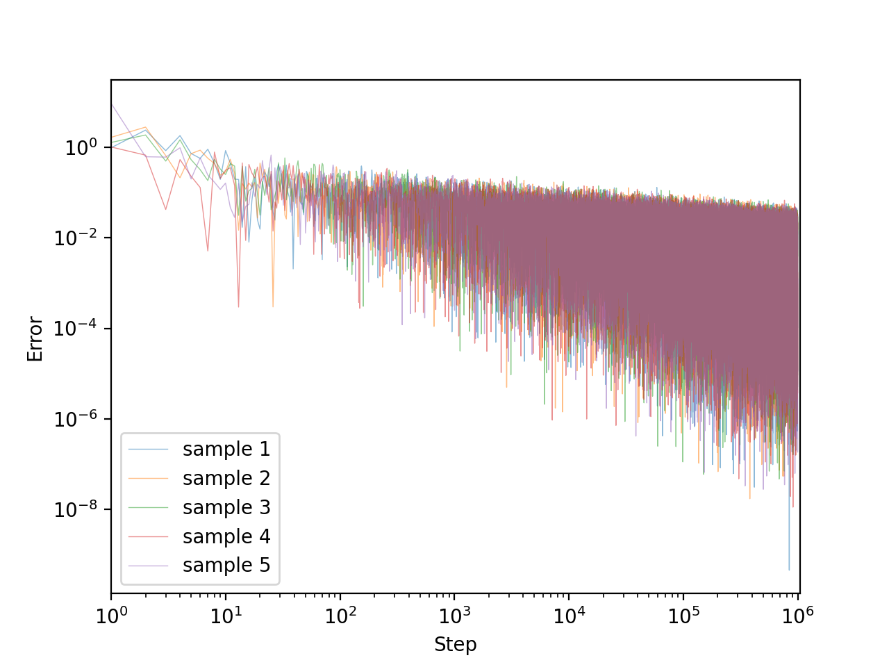

# Stochastic Approximation

This repository gives a Python implementation for some classical stochastic approximation algorithms, e.g., Robbins-Monro algorithm and Kiefer-Wolfowitz algorithm, along with the results of a few experiments.

## Robbins-Monro algorithm
### Description
The Robbins-Monro algorithm was proposed by Robbins and Monro (1951) and gradually improved by many authors. Here we state the version of Blum (1954).

Let $\{H(\cdot|x)\}_{x\in\mathbb{R}}$ be a family of distribution functions and let

```math
M(x) = \int_\mathbb{R}y\,\mathrm{d}H(y\mid x)\quad\text{for $x\in\mathbb{R}$}
```

be a measurable function. We can't know $M(x)$ directly, but we can choose any $x\in\mathbb{R}$ and sample according to the distribution $H(\cdot|x)$.
In this setting, we want to approximate the solution $x=\theta$ to

```math
M(x)=\alpha
```

for a given $\alpha\in\mathbb{R}$.

We assume the following.
1. $\exists c>0$ s.t. $|M(x)|\le c(1+|x|)$ for $x\in\mathbb{R}$.
2. $\exists\sigma>0$ s.t. $\displaystyle\int_\mathbb{R}(y-M(x))^2\,\mathrm{d}H(y\mid x)\le\sigma^2$ for $x\in\mathbb{R}$.
3. $M(x)<\alpha$ for $x<\theta$,&nbsp; $M(x)>\alpha$ for $x>\theta$.
4. $\displaystyle\inf_{\varepsilon\le|x-\theta|\le\varepsilon^{-1}}|M(x)-\alpha|>0$ for $\varepsilon>0$.

Let $(a_n)_{n=1}^\infty$ be a sequence of positive numbers such that

```math
\sum_{n=1}^\infty a_n=\infty\quad\text{and}\quad\sum_{n=1}^\infty a_n^2<\infty.
```

For any $x_1\in\mathbb{R}$, define a sequence $(x_n)_{n=1}^\infty$ of random variables as
```math
x_{n+1} = x_n + a_n(\alpha - y_n),
```

where $y_n$ is a random variable distributed according to $H(\cdot\mid x_n)$.
Then, Blum (1954) proved that $x_n\overset{\textrm{a.s.}}{\longrightarrow}\theta$ as $n\to\infty$.

### Experiments
Set $M(x)=x+2\sin x$ and $H(\cdot\mid x)=\mathcal{N}(M(x),1)$ (the normal distribution of mean $M(x)$ and variance $1$). Here is the graph of $M(x)$.
<div align="center">
    
</div>

Let $\alpha=0$ so that we find the solution $\theta=0$. $x_1$ is uniformly sampled from $[-10,10]$.

#### Experiment 1. $a_n=1/n$
All assumptions stated above are satisfied.

$5$ sample paths until $n=10^6$ are plotted. Here, the $x$-axis represents $n$ and the $y$-axis respresents $|x_n-\theta|$.
```bash
for i in {0..4}; do
    python robbins-monro/run.py 1000000 outputs/${i}.csv --step-power 1 --seed ${i}
done
python plot.py outputs/0.csv outputs/1.csv outputs/2.csv outputs/3.csv outputs/4.csv \
               -o resource/0.png --alpha 0.5
```
<div align="center">
    
</div>

Looks good. Convegence rate may be a polynomial order. Note that the graph is log-log.

#### Experiment 2. $a_n=1/n^{1.5}$
One of the assumption $\sum_{n=1}^\infty a_n=\infty$ does not hold.

```bash
for i in {0..4}; do
    python robbins-monro/run.py 1000000 outputs/${i}.csv --step-power 1.5 --seed ${i}
done
python plot.py outputs/0.csv outputs/1.csv outputs/2.csv outputs/3.csv outputs/4.csv \
               -o resource/1.png --alpha 0.5
```
<div align="center">
    
</div>

$(x_n)_{n=1}^\infty$ converged somewhere too early. Could not reach to $\theta$.

#### Experiment 3. $a_n=1/n^{0.5}$
One of the assumption $\sum_{n=1}^\infty a_n^2<\infty$ does not hold.

```bash
for i in {0..4}; do
    python robbins-monro/run.py 1000000 outputs/${i}.csv --step-power 0.5 --seed ${i}
done
python plot.py outputs/0.csv outputs/1.csv outputs/2.csv outputs/3.csv outputs/4.csv \
               -o resource/2.png --alpha 0.5
```
<div align="center">
    
</div>

$(x_n)_{n=1}^\infty$ may converge to $\theta$ but the convergence rate is significantly slow. The variance of $|x_n-\theta|$ is very large.

## Kiefer-Wolfowitz

