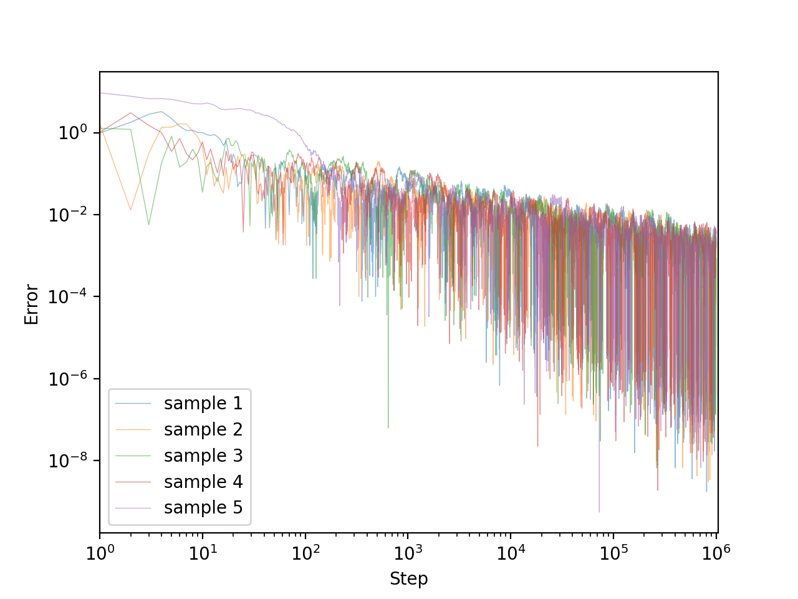

# Kiefer-Wolfowitz algorithm

## Description
The Kiefer-Wolfowitz algorithm was proposed by Kiefer and Wolfowitz (1952). Here we state the version of Blum (1954).

Let $\{H(\cdot|x)\}_{x\in\mathbb{R}}$ be a family of distribution functions and let

```math
M(x) = \int_\mathbb{R}y\,\mathrm{d}H(y\mid x)\quad\text{for $x\in\mathbb{R}$}
```

be a measurable function. We can't know $M(x)$ directly, but we can choose any $x\in\mathbb{R}$ and sample according to the distribution $H(\cdot|x)$.
In this setting, we want to find the maximizer $x=\theta$ of $M$, i.e.,

```math
M(\theta) = \max_{x\in\mathbb{R}}M(x).
```

We assume the following.
1. $\exists\sigma>0$ s.t. $\displaystyle\int_\mathbb{R}(y-M(x))^2\,\mathrm{d}H(y\mid x)\le\sigma^2$ for $x\in\mathbb{R}$.
    - This is the same as assumption 2 in the Robbins-Monro algorithm.
1. $M(x)$ is strictly increasing for $x\le\theta$ and strictly decreasing for $x\ge\theta$.
1. $\exists\rho>0,R>0$ s.t. $|x-x'|<\rho$ $|M(x)-M(x')|<R$.
1. $\forall\delta>0$, $\exists\pi(\delta)>0$ s.t. $\displaystyle|x-\theta|>\delta\Longrightarrow\inf_{0<\varepsilon<\delta/2}\frac{|M(x+\epsilon)-M(x-\epsilon)|}{\varepsilon}>\pi(\delta)$.

Let $(a_n)_{n=1}^\infty$ and $(c_n)_{n=1}^\infty$ be sequences of positive numbers satisfying

```math
\lim_{n\to\infty}c_n = 0,\quad\sum_{n=1}^\infty a_n = \infty,\quad\text{and}\quad\sum_{n=1}^\infty a_n^2<\infty.
```

For any $x_1\in\mathbb{R}$, define a sequence $(x_n)_{n=1}^\infty$ of random variables as

```math
x_{n+1} = x_n + a_n\frac{y_{2n}-y_{2n-1}}{c_n},
```

where $y_{2n}$ and $y_{2n-1}$ are independent random variables distributed according to $H(\cdot\mid x_n+c_n)$ and $H(\cdot\mid x_n-c_n)$ respectively.
Then, Blum (1954) proved that $x_n\overset{\textrm{a.s.}}{\longrightarrow}\theta$ as $n\to\infty$.

## Experiments
Set $M(x)=-|x|$ and $H(\cdot\mid x)=\mathcal{N}(M(x),1)$ (the normal distribution of mean $M(x)$ and variance $1$). Here is the graph of $M(x)$.
<div align="center">
    
</div>

We find the maximizer $\theta=0$. $x_1$ is uniformly sampled from $[-10,10]$.

### Experiment 1. $a_n=1/n$ and $c_n=1/\sqrt[3]{n}$
All assumptions stated above are satisfied.

$5$ sample paths until $n=10^6$ are plotted. Here, the $x$-axis represents $n$ and the $y$-axis respresents $|x_n-\theta|$.
```bash
for i in {0..4}; do
    python run.py 1000000 outputs/${i}.csv --seed ${i}
done
python ../plot.py outputs/0.csv outputs/1.csv outputs/2.csv outputs/3.csv outputs/4.csv \
                  -o ../resource/5.png --alpha 0.5
```
<div align="center">
    
</div>

### Experiment 2. $a_n=1/n$ and $c_n=1/\sqrt[3]{n}$
