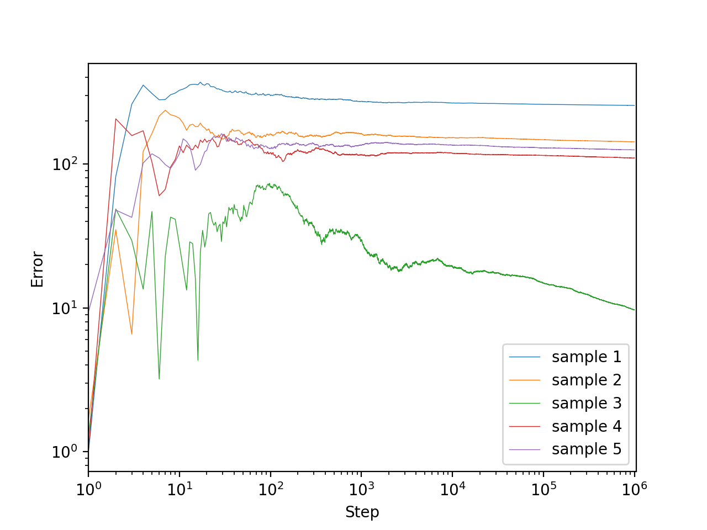
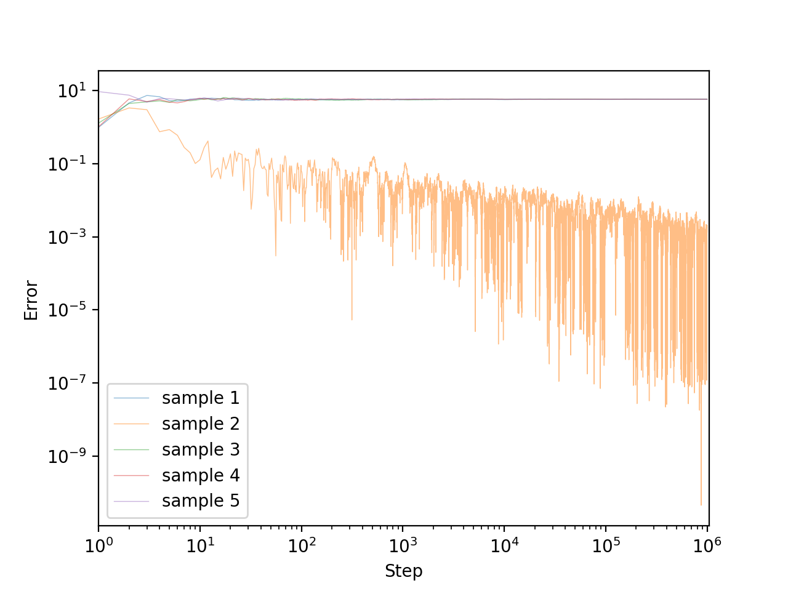

# Kiefer-Wolfowitz algorithm

## Description
The Kiefer-Wolfowitz algorithm was proposed by Kiefer and Wolfowitz (1952) and was generalized by many people. Here we state the version proved by Section 7 of Dvoretzky (1956).

Let $\lbrace Y(x)\rbrace_{x\in\mathbb{R}}$ be a family of $\mathbb{R}$-valued random variables.
Assume that the expected value

```math
M(x) = \mathbb{E}\lbrack Y(x)\rbrack
```

exists for any $x\in\mathbb{R}$ and that $M:\mathbb{R}\to\mathbb{R}$ is a measurable function.

We can't know $M(x)$ directly, but we can choose any $x\in\mathbb{R}$ and sample according to $Y(x)$.
In this setting, we want to find the maximizer of $M$.

For $f:\mathbb{R}\to\mathbb{R}$, the upper and lower derivatives of $f$ are defined by

```math
\overline{D}f(x) = \limsup_{\substack{h\to 0 \\ h\ne 0}}\frac{f(x+h)-f(x)}{h},\quad
\underline{D}f(x) = \liminf_{\substack{h\to 0 \\ h\ne 0}}\frac{f(x+h)-f(x)}{h}.
```

Note that when $f$ is differentiable, both of them coincide with $f'(x)$.

Let $\theta\in\mathbb{R}$. We assume that $Y$ and $M$ satisfy the following properties.
1. $\exists\sigma\gt 0$ s.t. $\mathrm{Var}(Y(x))\le\sigma^2$ for $x\in\mathbb{R}$.
1. $\exists C\gt 0,\exists D\gt 0$ s.t. $|M(x+1)-M(x)|\le C+D|x|$ for $x\in\mathbb{R}$.
1. $\displaystyle\inf_{\theta-1/\varepsilon\lt x\lt\theta-\varepsilon}\underline{D}M(x)\gt 0$ and $\displaystyle\sup_{\theta+\varepsilon\lt x\lt\theta+1/\varepsilon}\overline{D}M(x)\lt 0$ for $\varepsilon>0$.

Let $(a_n)_{n=1}^\infty$ and $(c_n) _ {n=1}^\infty$ be sequences of positive numbers satisfying

```math
\lim_{n\to\infty}c_n = 0,\quad
\sum_{n=1}^\infty a_n = \infty,\quad\text{and}\quad
\sum_{n=1}^\infty\frac{a_n^2}{c_n^2} \lt \infty.
```

For any $x_1\in\mathbb{R}$, define a sequence $(x_n)_{n=1}^\infty$ as

```math
x_{n+1} = x_n + a_n\frac{y_{2n}-y_{2n-1}}{c_n},
```

where $y_{2n}$ and $y_{2n-1}$ are observations on the random variables $Y(x_n+c_n)$ and $Y(x_n-c_n)$, respectively.
Then, Dvoretzky (1956) proved that $(x_n)_{n=1}^\infty$ converges to $\theta$ both in $L^2$ and with probability $1$.

## Experiments
Set $M(x)=-|x|$ and $Y(x)=\mathcal{N}(M(x),1)$ (the normal distribution of mean $M(x)$ and variance $1$). Here is the graph of $M$.
<div align="center">
    
</div>

The maximizer of $M$ is $\theta=0$. $x_1$ is sampled from $[-10,10]$ uniformly.

### Experiment 1. $a_n=1/n$ and $c_n=1/\sqrt[3]{n}$
All assumptions are satisfied.

$5$ sample paths until $n=10^6$ are plotted. Here, the $x$-axis represents $n$ and the $y$-axis represents $|x_n-\theta|$.
```bash
for i in {0..4}; do
    python run.py 1000000 outputs/${i}.csv --seed ${i}
done
python ../plot.py outputs/0.csv outputs/1.csv outputs/2.csv outputs/3.csv outputs/4.csv \
                  -o ../resource/5.png --alpha 0.5
```
<div align="center">
    
</div>

Looks good.
All sample paths appear to converge to $\theta$.
The speed of convergence is not so fast though.

### Experiment 2. $a_n=1/n$ and $c_n=0.01$
One of the assumption $\displaystyle\lim_{n\to\infty}c_n = 0$ does not hold.

```bash
for i in {0..4}; do
    python run.py 1000000 outputs/${i}.csv --step-coef-c 0.01 --step-power-c 0.0 --seed ${i}
done
python ../plot.py outputs/0.csv outputs/1.csv outputs/2.csv outputs/3.csv outputs/4.csv \
                  -o ../resource/6.png --alpha 1.0
```
<div align="center">
    
</div>

Some sample paths converged somewhere different from $\theta$.

### Experiment 3. $a_n=1/n^{1.5}$ and $c_n=1/n^{0.5}$
One of the assumption $\displaystyle\sum_{n=1}^\infty a_n=\infty$ does not hold.

```bash
for i in {0..4}; do
    python run.py 1000000 outputs/${i}.csv --step-power-a 1.5 --step-power-c 0.5 --seed ${i}
done
python ../plot.py outputs/0.csv outputs/1.csv outputs/2.csv outputs/3.csv outputs/4.csv \
                  -o ../resource/7.png --alpha 1.0
```
<div align="center">
    
</div>

Some sample paths converged somewhere too early. They could not reach to $\theta$.

### Experiment 4. $a_n=1/n$ and $c_n=1/n^{0.5}$
One of the assumption $\displaystyle\sum_{n=1}^\infty\frac{a_n^2}{c_n^2}\lt\infty$ does not hold.

```bash
for i in {0..4}; do
    python run.py 1000000 outputs/${i}.csv --step-power-c 0.5 --seed ${i}
done
python ../plot.py outputs/0.csv outputs/1.csv outputs/2.csv outputs/3.csv outputs/4.csv \
                  -o ../resource/8.png --alpha 0.5
```
<div align="center">
    
</div>

Each sample path appear not to converge. The variance of $x_n$ is very large.

### Experiment 5. $M(x)=-x^2$, $a_n=1/n$, and $c_n=1/\sqrt[3]{n}$
All assumptions are satisfied.

```bash
sed -i '' 's/-np.abs(x)/-x\*\*2/g' run.py
for i in {0..4}; do
    python run.py 1000000 outputs/${i}.csv --seed ${i}
done
sed -i '' 's/-x\*\*2/-np.abs(x)/g' run.py
python ../plot.py outputs/0.csv outputs/1.csv outputs/2.csv outputs/3.csv outputs/4.csv \
                  -o ../resource/9.png --alpha 0.5
```
<div align="center">
    
</div>

Looks good.

### Experiment 5. $M(x)=-|x|^3$, $a_n=1/n$, and $c_n=1/\sqrt[3]{n}$
Assumption 2 does not hold.

```bash
sed -i '' 's/-np.abs(x)/-np.abs(x)\*\*3/g' run.py
for i in {0..4}; do
    python run.py 10000 outputs/${i}.csv --seed ${i}
done
sed -i '' 's/-np.abs(x)\*\*3/-np.abs(x)/g' run.py
python ../plot.py outputs/0.csv outputs/1.csv outputs/2.csv outputs/3.csv outputs/4.csv \
                  -o ../resource/10.png --alpha 1.0
```
<div align="center">
    
</div>

All sample paths diverged.
Constant $x_n$ values after some moment caused by catastrophic cancellations. Actually, $y_{2n} = y_{2n-1}$ occured in the sense of double precision.

### Experiment 6. $M(x)=-|x|+2\cos x$, $a_n=1/n$, and $c_n=1/\sqrt[3]{n}$
Assumption 3 does not hold.
In fact, $M(x)$ has local maximums as shown in the following graph.
<div align="center">
    
</div>

```bash
sed -i '' 's/-np.abs(x)/-np.abs(x) + 2.0 \* np.cos(x)/g' run.py
for i in {0..4}; do
    python run.py 1000000 outputs/${i}.csv --seed ${i}
done
sed -i '' 's/-np.abs(x) + 2.0 \* np.cos(x)/-np.abs(x)/g' run.py
python ../plot.py outputs/0.csv outputs/1.csv outputs/2.csv outputs/3.csv outputs/4.csv \
                  -o ../resource/11.png --alpha 0.5
```
<div align="center">
    
</div>

Some sample paths converged to one of the other local maximizers $\pm 11\pi/6$ of $M$.
