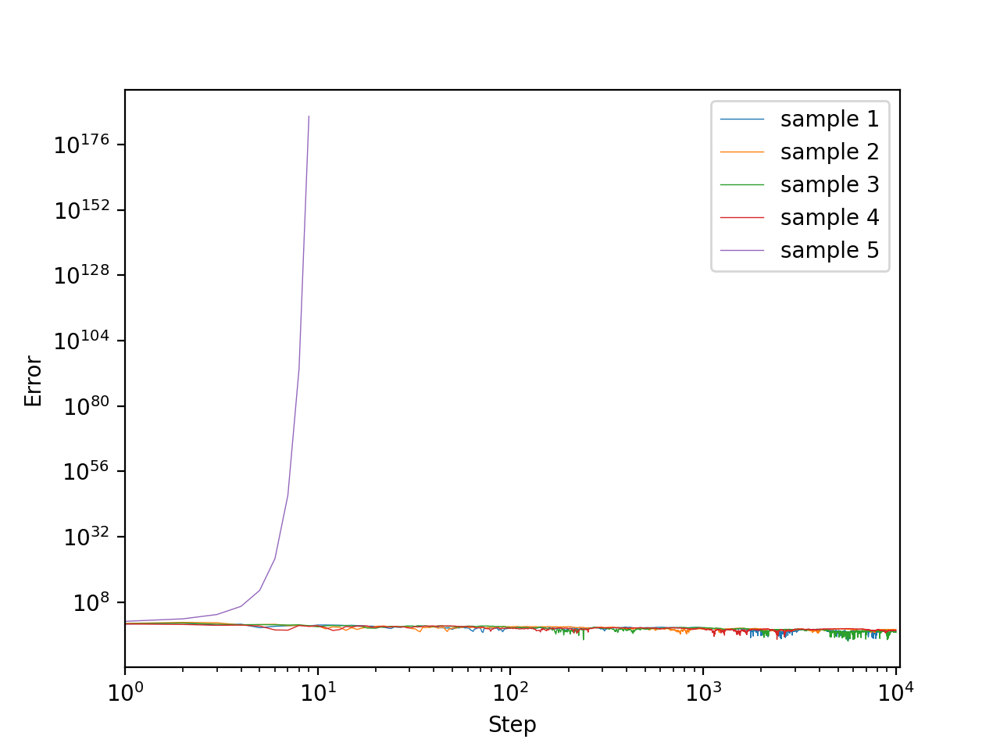
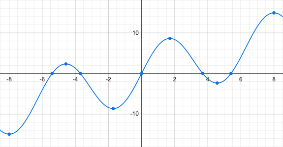

# Robbins-Monro algorithm

## Description
The Robbins-Monro algorithm was proposed by Robbins and Monro (1951) and was generalized by many people. Here we state the version proved by Section 7 of Dvoretzky (1956).

Let $\lbrace Y(x)\rbrace_{x\in\mathbb{R}}$ be a family of $\mathbb{R}$-valued random variables.
Assume that the expected value

```math
M(x) = \mathbb{E}\lbrack Y(x)\rbrack
```

exists for any $x\in\mathbb{R}$ and that $M:\mathbb{R}\to\mathbb{R}$ be a measurable function.

We can't know $M(x)$ directly, but we can choose any $x\in\mathbb{R}$ and sample according to $Y(x)$.
In this setting, we want to find the *root* of $M$.

Let $\theta\in\mathbb{R}$. We assume that $M$ satisfies the following properties.
1. $\exists C\gt 0,\exists D\gt 0$ s.t. $|M(x)|\le C+D|x|$ for $x\in\mathbb{R}$.
1. $\exists\sigma\gt 0$ s.t. $\mathrm{Var}(Y(x))\le\sigma^2$ for $x\in\mathbb{R}$.
1. $\displaystyle\sup_{\theta-1/\varepsilon\lt x\lt\theta-\varepsilon}M(x)\lt 0$ and $\displaystyle\inf_{\theta+\varepsilon\lt x\lt\theta+1/\varepsilon}M(x)\gt 0$ for $\varepsilon>0$.

Let $(a_n)_{n=1}^\infty$ be a sequence of positive numbers satisfying

```math
\sum_{n=1}^\infty a_n = \infty\quad\text{and}\quad
\sum_{n=1}^\infty a_n^2 \lt \infty.
```

For any $x_1\in\mathbb{R}$, define a sequence $(x_n)_{n=1}^\infty$ of numbers as

```math
x_{n+1} = x_n - a_n y_n,
```

where $y_n$ is an observation on the random variable $Y(x_n)$.
Then, Dvoretzky (1956) proved that $(x_n)_{n=1}^\infty$ converges to $\theta$ both in $L^2$ and with probability $1$.

Note that we actually find $\theta$ which satisfies assumption 3, and hence we don't need to impose $M(\theta)=0$.

## Experiments
Set $M(x)=x+2\sin x$ and $Y(x)=\mathcal{N}(M(x),1)$ (the normal distribution of mean $M(x)$ and variance $1$). Here is the graph of $M$.
<div align="center">
    
</div>

The root of $M$ is $\theta=0$. $x_1$ is sampled from $[-10,10]$ uniformly.

### Experiment 1. $a_n=1/n$
All assumptions stated above are satisfied.

$5$ sample paths until $n=10^6$ are plotted. Here, the $x$-axis represents $n$ and the $y$-axis represents $|x_n-\theta|$.
```bash
for i in {0..4}; do
    python run.py 1000000 outputs/${i}.csv --seed ${i}
done
python ../plot.py outputs/0.csv outputs/1.csv outputs/2.csv outputs/3.csv outputs/4.csv \
                  -o ../resource/0.png --alpha 0.5
```
<div align="center">
    
</div>

Looks good. Noting that the graph is log-log, the convergence rate may be a polynomial order.

### Experiment 2. $a_n=1/n^{1.5}$
One of the assumption $\displaystyle\sum_{n=1}^\infty a_n=\infty$ does not hold.

```bash
for i in {0..4}; do
    python run.py 1000000 outputs/${i}.csv --step-power 1.5 --seed ${i}
done
python ../plot.py outputs/0.csv outputs/1.csv outputs/2.csv outputs/3.csv outputs/4.csv \
                  -o ../resource/1.png --alpha 1.0
```
<div align="center">
    
</div>

Each sample path converged somewhere too early. They could not reach to $\theta$.

### Experiment 3. $a_n=1/n^{0.5}$
One of the assumption $\displaystyle\sum_{n=1}^\infty a_n^2\lt\infty$ does not hold.

```bash
for i in {0..4}; do
    python run.py 1000000 outputs/${i}.csv --step-power 0.5 --seed ${i}
done
python ../plot.py outputs/0.csv outputs/1.csv outputs/2.csv outputs/3.csv outputs/4.csv \
                  -o ../resource/2.png --alpha 0.5
```
<div align="center">
    
</div>

Each sample path may converge to $\theta$ but the convergence speed is significantly slow compared to experiment 1. The variance of $x_n$ is very large.

### Experiment 4. $M(x)=|x|x+2\sin x$ and $a_n=1/n$
Assumption 1 does not hold.

```bash
sed -i '' 's/x + 2.0 \* np.sin(x)/x \* np.abs(x) + 2.0 \* np.sin(x)/g' run.py
for i in {0..4}; do
    python run.py 10000 outputs/${i}.csv --seed ${i}
done
sed -i '' 's/x \* np.abs(x) + 2.0 \* np.sin(x)/x + 2.0 \* np.sin(x)/g' run.py
python ../plot.py outputs/0.csv outputs/1.csv outputs/2.csv outputs/3.csv outputs/4.csv \
                  -o ../resource/3.png --alpha 1.0
```
<div align="center">
    
</div>

A sample path diverged.

### Experiment 5. $M(x)=x+7\sin x$ and $a_n=1/n$
Assumption 3 does not hold.
In fact, $M(x)$ has multiple zeros as shown in the following graph.
<div align="center">
    
</div>

```bash
sed -i '' 's/x + 2.0 \* np.sin(x)/x + 7.0 \* np.sin(x)/g' run.py
for i in {0..4}; do
    python run.py 1000000 outputs/${i}.csv --seed ${i}
done
sed -i '' 's/x + 7.0 \* np.sin(x)/x + 2.0 \* np.sin(x)/g' run.py
python ../plot.py outputs/0.csv outputs/1.csv outputs/2.csv outputs/3.csv outputs/4.csv \
                  -o ../resource/4.png --alpha 0.5
```
<div align="center">
    
</div>

A sample path converged to one of the other zero of $M$.
