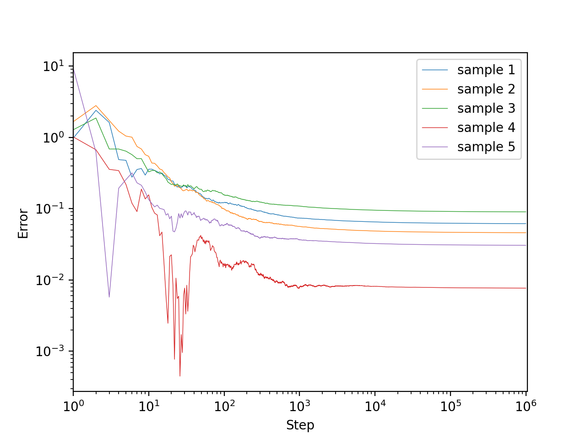

# Robbins-Monro algorithm

## Description
The Robbins-Monro algorithm was proposed by Robbins and Monro (1951) and gradually improved by many authors. Here we state the version of Blum (1954).

Let $\\{H(\cdot|x)\\}_{x\in\mathbb{R}}$ be a family of distribution functions and let

```math
M(x) = \int_\mathbb{R}y\,\mathrm{d}H(y\mid x)\quad\text{for $x\in\mathbb{R}$}
```

be a measurable function. We can't know $M(x)$ directly, but we can choose any $x\in\mathbb{R}$ and sample according to the distribution $H(\cdot|x)$.
In this setting, we want to approximate the solution $x=\theta$ to

```math
M(x) = \alpha
```

for a given $\alpha\in\mathbb{R}$.

We assume the following.
1. $\exists c\gt 0$ s.t. $|M(x)|\le c(1+|x|)$ for $x\in\mathbb{R}$.
1. $\exists\sigma\gt 0$ s.t. $\displaystyle\int_\mathbb{R}(y-M(x))^2\mathrm{d}H(y\mid x)\le\sigma^2$ for $x\in\mathbb{R}$.
1. $M(x)\lt\alpha$ for $x\lt\theta$ &nbsp;&nbsp;and&nbsp;&nbsp; $M(x)\gt\alpha$ for $x\gt\theta$.
1. $\displaystyle\inf_{\varepsilon\le|x-\theta|\le1/\varepsilon}|M(x)-\alpha|\gt 0$ for $\varepsilon>0$.

Let $(a_n)_{n=1}^\infty$ be a sequence of positive numbers satisfying

```math
\sum_{n=1}^\infty a_n = \infty\quad\text{and}\quad\sum_{n=1}^\infty a_n^2<\infty.
```

For any $x_1\in\mathbb{R}$, define a sequence $(x_n)_{n=1}^\infty$ of random variables as

```math
x_{n+1} = x_n + a_n(\alpha - y_n),
```

where $y_n$ is a random variable distributed according to $H(\cdot\mid x_n)$.
Then, Blum (1954) proved that $x_n\overset{\textrm{a.s.}}{\longrightarrow}\theta$ as $n\to\infty$.

Note that we actually find $\theta$ which satisfies assumption 3, and hence we don't need to assume $M(\theta)=\alpha$.

## Experiments
Set $M(x)=x+2\sin x$ and $H(\cdot\mid x)=\mathcal{N}(M(x),1)$ (the normal distribution of mean $M(x)$ and variance $1$). Here is the graph of $M$.
<div align="center">
    
</div>

Let $\alpha=0$ so that we find the solution $\theta=0$. $x_1$ is uniformly sampled from $[-10,10]$.

### Experiment 1. $a_n=1/n$
All assumptions stated above are satisfied.

$5$ sample paths until $n=10^6$ are plotted. Here, the $x$-axis represents $n$ and the $y$-axis respresents $|x_n-\theta|$.
```bash
for i in {0..4}; do
    python run.py 1000000 outputs/${i}.csv --seed ${i}
done
python ../plot.py outputs/0.csv outputs/1.csv outputs/2.csv outputs/3.csv outputs/4.csv \
                  -o ../resource/0.png --alpha 0.5
```
<div align="center">
    
</div>

Looks good. The convegence rate may be a polynomial order. Note that the graph is log-log.

### Experiment 2. $a_n=1/n^{1.5}$
One of the assumption $\displaystyle\sum_{n=1}^\infty a_n=\infty$ does not hold.

```bash
for i in {0..4}; do
    python run.py 1000000 outputs/${i}.csv --step-power 1.5 --seed ${i}
done
python ../plot.py outputs/0.csv outputs/1.csv outputs/2.csv outputs/3.csv outputs/4.csv \
                  -o ../resource/1.png --alpha 1.0
```
<div align="center">
    
</div>

Each sample path converged somewhere too early. They could not reach to $\theta$.

### Experiment 3. $a_n=1/n^{0.5}$
One of the assumption $\displaystyle\sum_{n=1}^\infty a_n^2\lt\infty$ does not hold.

```bash
for i in {0..4}; do
    python run.py 1000000 outputs/${i}.csv --step-power 0.5 --seed ${i}
done
python ../plot.py outputs/0.csv outputs/1.csv outputs/2.csv outputs/3.csv outputs/4.csv \
                  -o ../resource/2.png --alpha 0.5
```
<div align="center">
    
</div>

Each sample path may converge to $\theta$ but the convergence speed is significantly slow compared to experiment 1. The variance of $x_n$ is very large.

### Experiment 4. $M(x)=x^3+2\sin x$ and $a_n=1/n$
Assumption 1 does not hold.

```bash
sed -i '' 's/x + 2.0 \* np.sin(x)/x \*\* 3 + 2.0 \* np.sin(x)/g' run.py
for i in {0..4}; do
    python run.py 10000 outputs/${i}.csv --seed ${i}
done
sed -i '' 's/x \*\* 3 + 2.0 \* np.sin(x)/x + 2.0 \* np.sin(x)/g' run.py
python ../plot.py outputs/0.csv outputs/1.csv outputs/2.csv outputs/3.csv outputs/4.csv \
                  -o ../resource/3.png --alpha 1.0
```
<div align="center">
    
</div>

All sample paths except one diverged.

### Experiment 5. $M(x)=x+7\sin x$ and $a_n=1/n$
Assumption 3 does not hold.
In fact, $M(x)$ has multiple zeros as shown in the following graph.
<div align="center">
    
</div>

```bash
sed -i '' 's/x + 2.0 \* np.sin(x)/x + 7.0 \* np.sin(x)/g' run.py
for i in {0..4}; do
    python run.py 1000000 outputs/${i}.csv --seed ${i}
done
sed -i '' 's/x + 7.0 \* np.sin(x)/x + 2.0 \* np.sin(x)/g' run.py
python ../plot.py outputs/0.csv outputs/1.csv outputs/2.csv outputs/3.csv outputs/4.csv \
                  -o ../resource/4.png --alpha 0.5
```
<div align="center">
    
</div>

Some sample path converged to one of the other zero of $M$.
